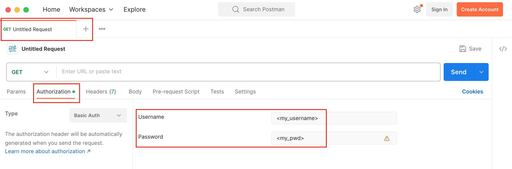
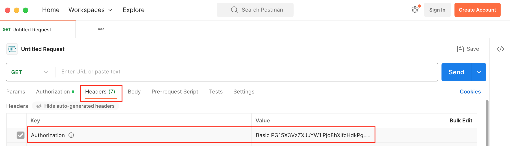
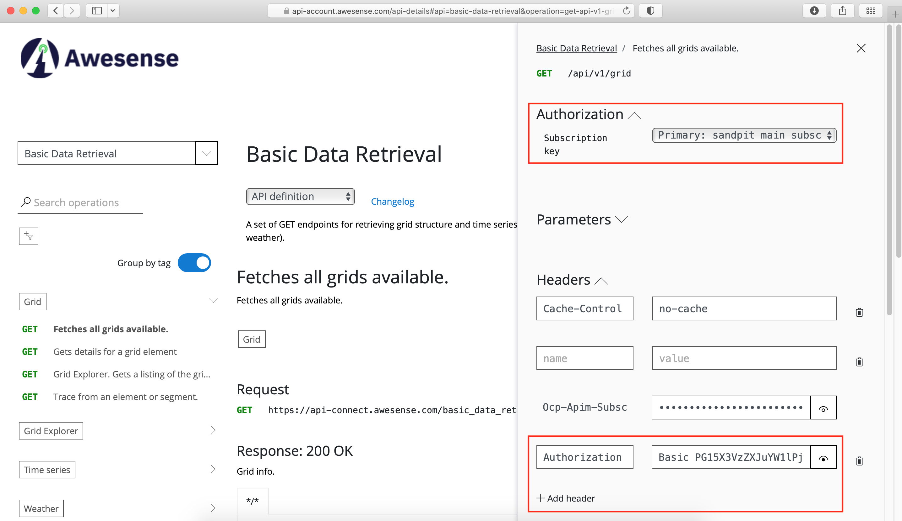

# rest_api &middot; [](../../LICENSE)
The rest_api within the intro_and_tutorials folder contains an introductory **tutorial notebook** to help you get started and learn how to access [Awesense](https://www.awesense.com)'s Energy Data Model (EDM) through the **REST APIs** by programmatic means.

## Running the Notebook

The REST API notebooks authenticate using HTTP Basic Auth with your TGI credentials. The host and username (`EDM_HOST`, `EDM_USER`) are read from a local `.env` file, Google Colab Secrets, or interactive prompts. See the [Authentication Setup Guide](../../SETUP.md#authentication-setup-guide) for how to configure each.

One REST-specific caveat: unlike the SQL API, the REST API has no `~/.pgpass` fallback for the password. When running interactively the notebooks prompt for it securely; for non-interactive runs (e.g. Papermill) supply it through the `EDM_PASSWORD` environment variable — exported into your shell as shown below — or a Colab Secret.

### Running with Papermill

[Papermill](https://papermill.readthedocs.io) runs a notebook non-interactively and injects its parameters (see the [general Papermill instructions](../../SETUP.md#running-notebooks-with-papermill) for setup). Because it can't prompt, set `EDM_PASSWORD` first (`EDM_HOST`/`EDM_USER` come from your `.env`):

```bash
# Prompt for the password without recording it in your shell history, then export it
read -rs "EDM_PASSWORD?EDM password: "; export EDM_PASSWORD

papermill intro_and_tutorials/rest_api/access_and_basic_data_retrieval.ipynb output.ipynb \
  --cwd intro_and_tutorials/rest_api \
  -p grid_id "awefice" \
  -p meter_id "m_6" \
  -p start "2021-01-01T08:00:00.000000Z" \
  -p end "2021-03-01T08:00:00.000000Z"

unset EDM_PASSWORD   # optional: clear it from the session when done
```

This notebook's parameters (defined in the cell tagged `parameters`) drive the `awefice` examples:

| Parameter  | Description                                | Example                         |
| ---------- | ------------------------------------------ | ------------------------------- |
| `grid_id`  | Target grid identifier                     | `awefice`                       |
| `meter_id` | Example meter grid element                 | `m_6`                           |
| `start`    | Time series range start (ISO 8601 UTC)     | `2021-01-01T08:00:00.000000Z`   |
| `end`      | Time series range end (ISO 8601 UTC)       | `2021-03-01T08:00:00.000000Z`   |

Do **not** pass the password with `-p` — Papermill records injected parameters into the output notebook in plaintext.

A summary of the REST APIs capabilities is available on Awesense's **TGI Platform Documentation** page, which is accessible on all servers by clicking the question mark symbol located on the top right corner of the TGI UI.

Additional help with the REST APIs is available through Awesense's **api-connect developer portal**, a self-serve system for REST API documentation and key management. Access to this is included with a Sandbox subscription (or full platform license). Below is some information to help you make the most of it.

* When an account is made for you on the portal, you will receive an automated email inviting you to activate the account. Upon activation, you will be able to access the documentation of the Basic Data Retrieval REST API (i.e. endpoint set) under the “APIs” page. (Note: Awesense offers additional endpoint sets on non-sandbox servers. Contact us at api@awesense.com for details.)
* Click on the API to see the endpoints. Click on each endpoint to see parameters, responses, etc. Click “Try it” to actually execute an endpoint against a sandbox server (more on this below).
  * Tip: enable the “Group by tag” toggle for easier navigation.
* Under the “Products” page, you will be able to see on which sandbox server you are allowed to execute endpoint requests. Click on a product and then subscribe to it in order to obtain a key needed for endpoint execution. (Note: You can subscribe to the same product multiple times if you want different keys for different purposes, such as different use cases you may build using the APIs.)
  * You can see and manage all your subscriptions and associated keys under the “Profile” page.
* When using “Try it” to execute an endpoint, you must select one of the created subscription keys. Then you must also add a header with the name “Authorization” and a value populated with an encryption of your TGI username and password for the target sandbox server. You can obtain this using a tool like Postman (open a tab, go to Authorization, select Basic, and enter your TGI credentials; this will populate an authorization header for you in the Headers tab; copy over to the developer portal) — or similar. See screenshots below for guidance (actual UI may differ slightly).

Postman authorization credentials example:



Postman authorization encrypted header example:



Developer portal "Try it" setup example:


